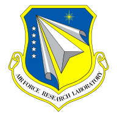
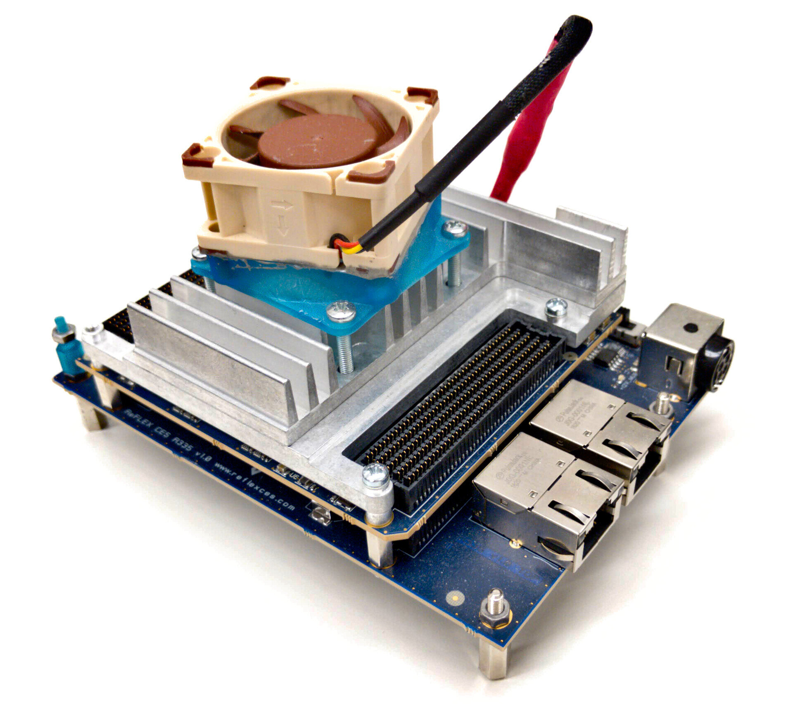
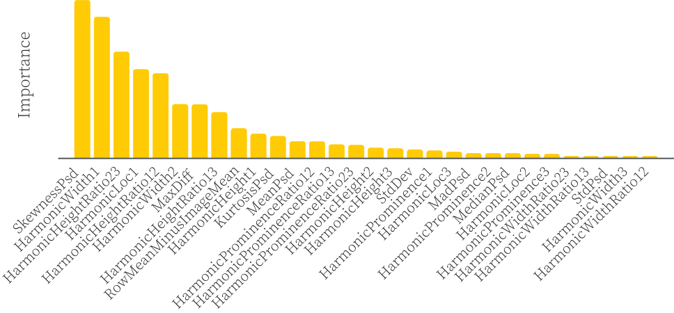

---
# try also 'default' to start simple
theme: default
# random image from a curated Unsplash collection by Anthony
# apply any windi css classes to the current slide
class: "text-center"
layout: intro
# https://sli.dev/custom/highlighters.html
highlighter: shiki
# show line numbers in code blocks
lineNumbers: false
# some information about the slides, markdown enabled
info: |
  ## Toward a Hardware Implementation of Lidar-based Real-time Insect Detection

  SPIE Real-time Imaging and Deep Learning 2022
# persist drawings in exports and build
drawings:
  persist: false
fonts:
  # basically the text
  sans: 'Source Sans Pro'
  # use with `font-serif` css class from windicss
  serif: 'Nunito'
  # for code blocks, inline code, etc.
  mono: 'Fira Code'
---

# Toward a Hardware Implementation of Lidar-based Real-time Insect Detection

SPIE Real-time Imaging and Deep Learning 2022

Trevor C. Vannoy, Elizabeth M. Rehbein, Riley D. Logan, Joseph A. Shaw, Bradley M. Whitaker

<div class="flex justify-evenly">


</div>

<style>
.slidev-layout.intro h1 {
  font-size: 3rem;
}
</style>

---
layout: cover
background: '/georgian-constantin-fB5gpeebXig-unsplash.jpg'
---

# Monitoring insects

<p class="absolute bottom-0 left-5 text-sm">
Photo by <a href="https://unsplash.com/@anotheroutsider?utm_source=unsplash&utm_medium=referral&utm_content=creditCopyText">Georgian Constantin</a> on <a href="https://unsplash.com/s/photos/flying-insects?utm_source=unsplash&utm_medium=referral&utm_content=creditCopyText">Unsplash</a>
</p>
  

---
layout: image
image: '/sara-kurfess-H1rAeZ1Raww-unsplash.jpg'
---

# Why monitor insects? Population decline

<p class="absolute bottom-0 left-5 text-sm">
Photo by <a href="https://unsplash.com/@stereophototyp?utm_source=unsplash&utm_medium=referral&utm_content=creditCopyText">Sara Kurfeß</a> on <a href="https://unsplash.com/?utm_source=unsplash&utm_medium=referral&utm_content=creditCopyText">Unsplash</a>
</p>  

---
layout: image
image: '/1178006-LGPT.jpg'
---

# Why monitor insects? Ecosystem damage


<p class="absolute bottom-0 left-5 text-sm text-light-50">
 Connecticut Agricultural Experiment Station , Connecticut Agricultural Experiment Station, Bugwood.org <br>
licensed under a <a rel="license" href="http://creativecommons.org/licenses/by-nc/3.0/us/">Creative Commons Attribution-Noncommercial 3.0 License</a>.
</p>

<style>
  h1 {
    @apply text-shadow-xl
  }
</style>

---
layout: image
image: '/1643211-LGPT.jpg'
---

# Traditional methods are slow

<p class="absolute bottom-0 left-5 text-sm text-light-50">
USDA Forest Service - Coeur d’Alene Field Office , Bugwood.org <br>
licensed under a <a rel="license" href="http://creativecommons.org/licenses/by-nc/3.0/us/">Creative Commons Attribution-Noncommercial 3.0 License</a>.
</p>

<style>
  h1 {
    @apply text-dark-700
  }
</style>

---
layout: image
image: '/1291029-LGPT.jpg'
---

# Traditional methods are slow

<p class="absolute bottom-0 left-5 text-sm text-light-50">
Gary L. Piper, Washington State University, Bugwood.org <br>
licensed under a <a rel="license" href="http://creativecommons.org/licenses/by/3.0/us/">Creative Commons Attribution 3.0 License</a>.
</p>

<style>
  h1 {
    @apply text-shadow-xl
  }
</style>

---
layout: image
image: '/0025086-LGPT.jpg'
---

# Traditional methods are slow

<p class="absolute bottom-0 left-5 text-sm text-light-50">
Norman E. Rees, USDA Agricultural Research Service - Retired, Bugwood.org<br>
licensed under a <a rel="license" href="http://creativecommons.org/licenses/by/3.0/us/">Creative Commons Attribution 3.0 License</a>.
</p>

---
layout: cover
background: '/image6-153.jpeg'
---

# Monitoring insects with lidar

---
layout: image
image: '/insect-detection-bg.svg'
---

# Monitoring insects with lidar

<style>
  h1 {
    @apply text-dark-700
  }
</style>

---
layout: image
image: '/insect-detection-time-domain.svg'
---

# Insect detection intuition

<style>
  h1 {
    @apply text-dark-700
  }
</style>

---
layout: image-left
image: '/insect-lidar-telescope.jpeg'
---

# Lidar system and data


---
layout: image
image: '/data-classification-overview.svg'
---

# Insect detection with a neural network

<style>
  h1 {
    @apply text-dark-700
  }
</style>

---
layout: image-right
image: '/lidar-system.jpeg'
---

# Previous work limitations

<br/>
<br/>
<br/>
<br/>
<br/>
<br/>

- ## Offline analysis <fxemoji-desktopcomputer class="text-5xl"/> <fxemoji-personalcomputer class="text-5xl"/>

<br/>
<br/>
<br/>
<br/>
<br/>
<br/>

- ## Not embedded <wpf-integrated-circuit class="text-5xl"/>

<style>
h1 {
  font-size: 2rem;
}
</style>

---
layout: statement
---

# Goal: 

# implement insect detection on an FPGA

<div class="flex justify-center">

</div>

---

# What needs to be done

<br>
<br>
<br>
<br>
<br>

- Convert feature extraction software into HDL

<br>
<br>
<br>
<br>
<br>

- Convert neural network inference software into HDL


<style>
li {
  font-size: 2rem;
  margin-bottom: 1rem;
}
</style>

---
layout: section
---

# Feature extraction overview

---
layout: image
image: '/feature-extraction.svg'
---

# Feature extraction process

<style>
  h1 {
    @apply text-dark-700
  }
</style>

---

# Features listed by importance 
(Minimum Redundancy --- Maximxum-Relevance)




---
layout: section
---

# Software-to-hardware conversion


---
clicks: 3
---

# Algorithms $\rightarrow$ hardware: the traditional way

<div class="grid grid-cols-3 grid-rows-2 gap-10 content-center justify-center justify-self-center content-center items-center place-items-center">
<div>

</div>
<div v-click="1">
<noto-v1-woman-technologist class="text-8xl object-center place-self-center" />
</div>
<div v-click="1">

```vhdl
entity presentation is
  port(
    clk : in std_logic;
    rst : in std_logic;
    d   : out unsigned(7 downto 0)
  );
end entity;
...
a < = not b xor c;
d < = left_shift(var(7 downto 0),2);
...
```
</div>
<div v-click="2">

</div>
<div v-click="3" class="col-span-2">

<emojione-anxious-face-with-sweat class="text-10xl object-center place-self-center pb-8" />

</div>
</div>

<arrow v-click="1" x1="310" y1="220" x2="430" y2="220" color="#666" width="3" arrowSize="1" />
<arrow v-click="1" x1="550" y1="220" x2="650" y2="220" color="#666" width="3" arrowSize="1" />
<arrow v-click="2" x1="650" y1="320" x2="120" y2="430" color="#666" width="3" arrowSize="1" />
<arrow v-click="3" x1="310" y1="480" x2="550" y2="480" color="#666" width="3" arrowSize="1" />

---
clicks: 3
---

# Algorithms $\rightarrow$ hardware: using high-level synthesis

<div class="grid grid-cols-3 grid-rows-2 gap-10 content-center justify-center justify-self-center content-center items-center place-items-center">
<div>

</div>
<div v-click="1">
<emojione:desktop-computer class="text-8xl" />
<emojione:gear class="text-5xl" />
</div>
<div v-click="1">

```vhdl
entity presentation is
  port(
    clk : in std_logic;
    rst : in std_logic;
    d   : out unsigned(7 downto 0)
  );
end entity;
...
a < = not b xor c;
d < = left_shift(var(7 downto 0),2);
...
```
</div>
<div v-click="2">

</div>
<div v-click="3" class="col-span-2">

<emojione-worried-face class="text-10xl pb-8" />
<emojione:person-shrugging class="text-10xl pb-8" />

</div>
</div>

<arrow v-click="1" x1="310" y1="220" x2="390" y2="220" color="#666" width="3" arrowSize="1" />
<arrow v-click="1" x1="580" y1="220" x2="650" y2="220" color="#666" width="3" arrowSize="1" />
<arrow v-click="2" x1="650" y1="320" x2="120" y2="430" color="#666" width="3" arrowSize="1" />
<arrow v-click="3" x1="310" y1="480" x2="460" y2="480" color="#666" width="3" arrowSize="1" />

---
layout: image
image: '/matlab-to-hdl.svg'
---

# Convert MATLAB to HDL

<p class="absolute bottom-0 left-5 text-xs text-true-gray-400">
MATLAB icon by Roberto Huertas
licensed under <a rel="license" href="http://creativecommons.org/licenses/by/4.0/us/">Creative Commons Attribution 4.0 License</a>.
</p>


<v-clicks>
<emojione-v1-cross-mark class="absolute bottom-1/8 left-2/7 text-20xl"/>
</v-clicks>


<style>
  h1 {
    @apply text-dark-700
  }
</style>


---
layout: image
image: '/matlab-to-simulink-to-hdl.svg'
---

# Use Simulink instead

<style>
  h1 {
    @apply text-dark-700
  }
</style>

<p class="absolute bottom-0 left-5 text-xs text-true-gray-400">
MATLAB icon by Roberto Huertas
licensed under <a rel="license" href="http://creativecommons.org/licenses/by/4.0/us/">Creative Commons Attribution 4.0 License</a>.
</p>

---

# Implementation challenges

<br>
<br>

- HDL Coder has poor error traceability
- Median isn't easy to implement in a hardware-friendly way
- Peak finding algorithm was not hardware-friendly
  - Used *2.8 million* adders
- Features had a large dynamic range
- Design used *way too many* resources


<style>
li {
  font-size: 1.5rem;
  margin-bottom: 1rem;
}
</style>


---

# Future directions

<br>
<br>

- Increase resource sharing
- Implement a hardware-friendly peak finding algorithm
- Try using a DSP chip instead of an FPGA

<br>
<br>
<br>
<br>

# Takeaway: 
### FPGAs are still hard to develop for, even with high-level synthesis tools

<style>
li {
  font-size: 1.5rem;
  margin-bottom: 1rem;
}
</style>

---
layout: section
---

# Backup slides

---

# Lidar system diagram


